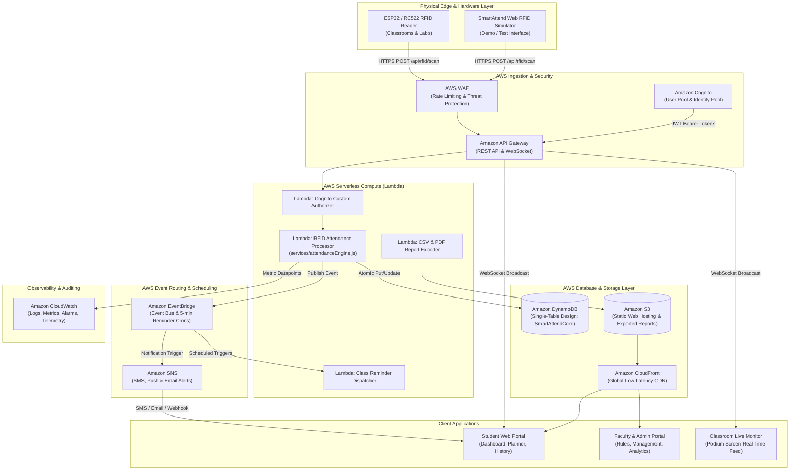

# SmartAttend — AWS Cloud Architecture Documentation

This document describes the production cloud architecture for **SmartAttend: RFID-Based Smart Attendance & Class Management System**, designed specifically for deployment on **Amazon Web Services (AWS)**.

---

## 1. High-Level Architecture Diagram



---

## 2. AWS Services Mapping & Responsibilities

| AWS Service | Role in SmartAttend | Configuration Details |
| :--- | :--- | :--- |
| **Amazon Cognito** | Authentication & User Directories | User Pool with custom attributes (`custom:student_id`, `custom:rfid_card_id`, `custom:department`), User Groups (`Students`, `Faculty`, `Admins`), JWT Bearer Token authorization. |
| **Amazon API Gateway** | Managed REST & WebSocket API | Route: `POST /api/rfid/scan` (RFID ingestion), `GET /api/attendance/live` ($connect WebSocket route), request validation, throttling (10,000 req/sec limit). |
| **AWS Lambda** | Event-Driven Business Logic | Zero cold-start optimization with provisioned concurrency for attendance processor. Uses identical pure logic from `services/attendanceEngine.js`. |
| **Amazon DynamoDB** | Single-Table Scalable NoSQL Store | Table `SmartAttendCore`. On-Demand billing, point-in-time recovery, continuous replication. |
| **Amazon EventBridge** | Event Bus & Automated Cron | Scheduled rule `cron(*/5 8-18 ? * MON-SAT *)` triggering 30m/15m/5m class reminders before scheduled slots. |
| **Amazon SNS** | Notification Broadcasting | Topics for `smartattend-attendance-alerts` (urgent low-attendance warnings) and `smartattend-class-reminders`. |
| **Amazon CloudWatch** | Logs, Metrics & Telemetry | Log groups for Lambda invocations, custom CloudWatch metrics for scan latency and duplicate rejections. |
| **Amazon S3 & CloudFront** | Static Web Hosting & Export Archive | Static assets (HTML/CSS/JS) distributed via CloudFront edge locations with SSL certificates. |

---

## 3. Amazon DynamoDB Single-Table Design (`SmartAttendCore`)

SmartAttend utilizes an industry-standard Single-Table NoSQL schema for high throughput, sub-10ms response times, and zero relational bottlenecks during peak card-swiping rush hours.

### Primary Table Structure:
- **Partition Key (`PK`)**: Entity Identifier String
- **Sort Key (`SK`)**: Hierarchy / Timestamp String
- **Global Secondary Index 1 (`GSI1`)**: `GSI1PK` (Date / Partition) and `GSI1SK` (Time / Status)

### Entity Mapping Pattern:

| Entity Type | `PK` | `SK` | `GSI1PK` | `GSI1SK` | Attributes |
| :--- | :--- | :--- | :--- | :--- | :--- |
| **Student** | `STUDENT#<student_id>` | `PROFILE` | `DEPT#<department>` | `<student_id>` | `name`, `email`, `rfid_card_id`, `year`, `section`, `status` |
| **RFID Mapping** | `RFID#<rfid_card_id>` | `BINDING` | — | — | `student_id`, `status`, `assigned_date` |
| **Subject** | `SUBJECT#<subject_id>` | `METADATA` | `DEPT#<department>` | `<subject_id>` | `subject_name`, `faculty`, `credits`, `attendance_requirement` |
| **Timetable** | `TIMETABLE#<day>` | `SLOT#<start_time>#<room>` | `ROOM#<room>` | `<start_time>` | `subject_id`, `reader_id`, `periods`, `consecutive` |
| **Attendance Record** | `STUDENT#<student_id>` | `ATT#<date>#<time>` | `DATE#<date>` | `TIME#<time>#<status>` | `subject_id`, `room`, `status`, `classes_credited`, `remarks`, `reader_id` |
| **Attendance Rules** | `CONFIG` | `RULES` | — | — | `grace_period_minutes`, `late_threshold_minutes`, `cutoff_minutes`, `min_target` |
| **RFID Reader** | `READER#<reader_id>` | `STATUS` | `LOCATION#<building>` | `<room>` | `ip_address`, `status`, `last_seen`, `hardware_model` |

---

## 4. Lambda Function Handlers

### 4.1 Attendance Processor Handler (`attendanceProcessor.js`)
```javascript
const { processRfidScan } = require('./attendanceEngine');
const DynamoDB = require('@aws-sdk/client-dynamodb');
const SNS = require('@aws-sdk/client-sns');

exports.handler = async (event) => {
  const body = JSON.parse(event.body);
  const { rfid_card_id, reader_id, timestamp } = body;

  // 1. Fetch Student, Timetable & Rules from DynamoDB
  const dbData = await fetchContextFromDynamoDB(rfid_card_id, reader_id);

  // 2. Evaluate using identical mathematical engine
  const evalResult = processRfidScan({
    rfid_card_id,
    reader_id,
    timestamp,
    db: dbData
  });

  // 3. Persist record atomically in DynamoDB
  if (evalResult.success) {
    await saveAttendanceRecord(evalResult.record);
    
    // 4. Send Real-Time WebSocket Push to Connected Podium Displays & Dashboards
    await broadcastToWebSockets(evalResult);
  }

  return {
    statusCode: evalResult.success ? 200 : 400,
    headers: { 'Content-Type': 'application/json', 'Access-Control-Allow-Origin': '*' },
    body: JSON.stringify(evalResult)
  };
};
```

---

## 5. Security & Principle of Least Privilege

1. **No Sensitive Hardcoding**: Frontend does not embed AWS credentials, IAM secret keys, or DynamoDB table credentials. Communication occurs solely through Amazon API Gateway with Cognito JWT verification.
2. **RFID Tag Obfuscation**: In normal student UI views, physical RFID hardware IDs are masked (e.g. `••••1042`), preventing card cloning or eavesdropping.
3. **Anti-Replay & Duplicate Protection**: The evaluation engine rejects scans repeated within the configurable window (`duplicate_scan_window_seconds`, default: 300s).
4. **AWS WAF (Web Application Firewall)**: Protects the API Gateway ingestion endpoint from Denial of Service (DoS) and automated card brute-forcing.

---

## 6. AWS SAM Deployment Template (`template.yaml`)

```yaml
AWSTemplateFormatVersion: '2010-09-09'
Transform: AWS::Serverless-2016-10-31
Description: SmartAttend AWS Cloud Infrastructure

Globals:
  Function:
    Timeout: 10
    Runtime: nodejs20.x
    MemorySize: 512
    Environment:
      Variables:
        TABLE_NAME: !Ref SmartAttendTable

Resources:
  SmartAttendTable:
    Type: AWS::DynamoDB::Table
    Properties:
      TableName: SmartAttendCore
      BillingMode: PAY_PER_REQUEST
      AttributeDefinitions:
        - AttributeName: PK
          AttributeType: S
        - AttributeName: SK
          AttributeType: S
        - AttributeName: GSI1PK
          AttributeType: S
        - AttributeName: GSI1SK
          AttributeType: S
      KeySchema:
        - AttributeName: PK
          KeyType: HASH
        - AttributeName: SK
          KeyType: RANGE
      GlobalSecondaryIndexes:
        - IndexName: GSI1
          KeySchema:
            - AttributeName: GSI1PK
              KeyType: HASH
            - AttributeName: GSI1SK
              KeyType: RANGE
          Projection:
            ProjectionType: ALL

  RfidScanFunction:
    Type: AWS::Serverless::Function
    Properties:
      Handler: attendanceProcessor.handler
      CodeUri: ./
      Policies:
        - DynamoDBCrudPolicy:
            TableName: !Ref SmartAttendTable
      Events:
        RfidApi:
          Type: Api
          Properties:
            Path: /api/rfid/scan
            Method: POST
```
